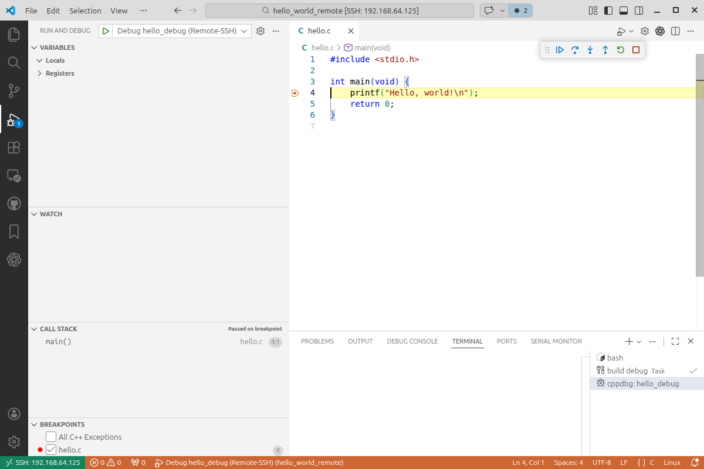

# Hello World Debugging on Raspberry Pi from VS Code on a PC

To get the source files onto the Raspberry Pi, clone the repository on the Pi:

```bash
cd /home/pi
git clone https://github.com/ur8us/hello_world_remote.git
cd /home/pi/hello_world_remote
```

This folder contains a minimal C example that shows how to:

- compile a program on a Raspberry Pi
- generate a debug build with symbols
- open the Pi workspace from a PC using VS Code Remote-SSH
- run and debug the program from the source code window in VS Code

Note: this project does not use `gdbserver`. VS Code connects to the Raspberry Pi with Remote-SSH and runs `gdb` directly on the Pi.

## Files

- `hello.c` - simple Hello World program
- `hello_debug` - debug build of the program
- `.vscode/launch.json` - VS Code debugger configuration for Remote-SSH

## Example Program

```c
#include <stdio.h>

int main(void) {
    printf("Hello, world!\n");
    return 0;
}
```

## Requirements

On the Raspberry Pi:

- `gcc`
- `gdb`
- SSH enabled

On the PC:

- Visual Studio Code
- `Remote - SSH` extension
- `C/C++` extension by Microsoft

## Build on the Raspberry Pi

This project includes a `Makefile` with debug and release targets.

Open a terminal on the Pi or in the VS Code Remote-SSH window and run:

```bash
cd /home/pi/hello_world_remote
make debug
make release
```

Available targets:

- `make debug` builds `hello_debug` with `-g -O0`
- `make release` builds `hello` with `-O2`
- `make all` builds both binaries
- `make clean` removes both binaries

What these flags mean:

- `-g` adds debug symbols
- `-O0` disables optimization so stepping is easier to follow
- `-O2` enables release-style optimization
- `-Wall -Wextra` enables useful compiler warnings

## Open the Project from the PC

After the repository is cloned to the Raspberry Pi, you must connect VS Code on the PC to the Pi with Remote-SSH. The build and debug steps in this README are meant to run inside that remote VS Code window.

In VS Code on the PC:

1. Install the `Remote - SSH` extension
2. Install the `C/C++` extension
3. Press `F1`, run `Remote-SSH: Connect to Host...`, then enter `pi@192.168.64.125`
4. Wait for VS Code to open a new remote window connected to the Pi
5. In that remote window, open the folder `/home/pi/hello_world_remote`

Once connected, VS Code runs the debugger on the Pi directly.

## How to Debug

1. Open `hello.c`
2. Click in the gutter next to line 4 to set a breakpoint on:

```c
printf("Hello, world!\n");
```

3. In the Run and Debug panel, select:

```text
Debug hello_debug (Remote-SSH)
```

4. Press `F5`

Expected result:

- VS Code runs `make debug` automatically on the Raspberry Pi
- VS Code launches `hello_debug` on the Raspberry Pi
- execution stops at the breakpoint in `hello.c`
- you can step through the code from the editor

Example of the debugger stopped at the breakpoint:



To build and run the optimized binary instead, select:

```text
Run hello release (Remote-SSH)
```

That configuration runs `make release` automatically before launch.

## Useful Debug Keys

- `F5` - Continue
- `F10` - Step Over
- `F11` - Step Into
- `Shift+F11` - Step Out
- `Shift+F5` - Stop Debugging

## What You Should See

At the breakpoint:

- the yellow execution line in `hello.c`
- `main()` in the Call Stack
- locals/registers in the Variables pane

After stepping over the `printf`:

- `Hello, world!` appears in the integrated terminal
- execution moves to:

```c
return 0;
```

## Why Remote-SSH Is the Right Setup

For this case, `gdbserver` is not needed.

Using VS Code Remote-SSH is simpler because:

- source files stay on the Pi
- the binary runs on the Pi
- `gdb` runs on the Pi
- VS Code on the PC acts as the front-end only

That avoids port forwarding, attach timing issues, and `gdbserver` task management.

## Rebuild After Changes

If you change `hello.c`, you can rebuild manually:

```bash
cd /home/pi/hello_world_remote
make debug
```

Or let VS Code rebuild automatically when you start either launch configuration.

## Summary

This directory is a minimal working example of remote C development on Raspberry Pi:

- write code on the Pi
- connect from a PC with VS Code Remote-SSH
- compile with debug symbols
- debug directly from the editor with breakpoints and stepping

Note: this project and its setup notes were created with help from GPT-5.3-Codex.
